<div align="center">

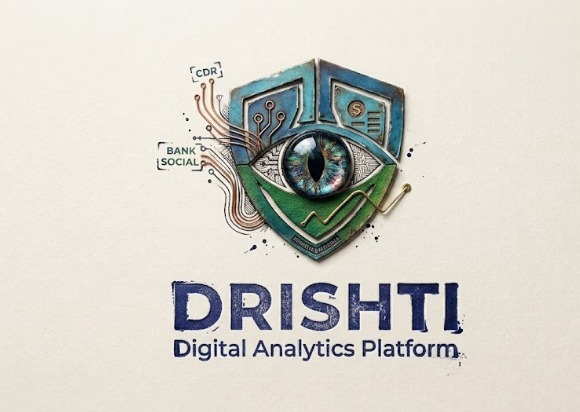

<h1>🛡️ DRISHT1</h1>

<p>
  
</p>

<p>
<strong>
Connecting Telecom, Financial &amp; Social Intelligence to uncover hidden patterns,
detect anomalies, and generate explainable, actionable insights.
</strong>
</p>

<br>

<a href="#overview">Overview</a>
&nbsp;•&nbsp;
<a href="#intelligence-architecture">Architecture</a>
&nbsp;•&nbsp;
<a href="#intelligence-domains">Intelligence Domains</a>
&nbsp;•&nbsp;
<a href="#cross-domain-entity-resolution">Entity Resolution</a>

<br><br>


</div>

---


# Overview

**DRISHT1** is a unified digital intelligence and analytics platform designed to correlate multiple digital footprints into a single investigative view.

Instead of analyzing telecom records, financial transactions, and social-media activity independently, DRISHT1 focuses on the intelligence layer that connects them.

The platform is designed around a central investigative workflow:

> **Ingest → Normalize → Resolve → Correlate → Analyze → Detect → Explain**

By connecting identifiers, relationships, behavior, and temporal activity across multiple domains, DRISHT1 helps transform fragmented datasets into structured, evidence-based intelligence.

---

## Intelligence at a Glance

<table>
<tr>

<td width="33%" align="center">

### 📞 Telecom

CDR & IPDR intelligence

Communication patterns  
Network activity  
Location signals

</td>

<td width="33%" align="center">

### 🏦 Financial

Transaction intelligence

Money movement  
Counterparty analysis  
Behavioral anomalies

</td>

<td width="33%" align="center">

### 🌐 Social

Activity intelligence

Posts & interactions  
Entity references  
Behavioral signals

</td>

</tr>
</table>

<br>

<table>
<tr>

<td width="33%" align="center">

### 🔗 Resolve

Cross-domain identity correlation and confidence-based entity linking.

</td>

<td width="33%" align="center">

### 🕸️ Analyze

Relationship networks, communities, indirect connections, and behavioral patterns.

</td>

<td width="33%" align="center">

### 🚨 Explain

Evidence-backed anomaly detection and investigator-readable intelligence.

</td>

</tr>
</table>

---

# Problem Landscape

Investigative analysis often involves multiple datasets that exist independently from one another.

A case may involve communication records, financial transactions, and social activity, but the connections between these datasets are not always immediately visible.

| Intelligence Source | Typical Data | Investigation Challenge |
|---|---|---|
| **Telecom CDR / IPDR** | Calls, durations, towers, IP sessions, data activity | Large volumes and complex communication patterns |
| **Financial Records** | Transactions, counterparties, amounts, timestamps | Difficult cross-reference and behavioral correlation |
| **Social Activity** | Posts, connections, mentions, engagement, geo-tags | Often isolated from other investigative data |

Individually, each source can provide useful signals.

However, important relationships may only emerge when identifiers and activity are correlated across domains.

### The core challenge

> **The problem is not simply parsing multiple file formats. The harder problem is identifying entities, connecting relationships, detecting deviations, and preserving the evidence behind every investigative insight.**

---

# DRISHT1 Intelligence Approach

DRISHT1 is built around five core stages.

| Stage | Intelligence Function |
|---|---|
| **01 — Ingest** | Collect authorized telecom, financial, and social-media data |
| **02 — Normalize** | Standardize identifiers, timestamps, locations, and records |
| **03 — Resolve** | Connect cross-domain identifiers to potential real-world entities |
| **04 — Analyze** | Build relationship networks and identify behavioral patterns |
| **05 — Explain** | Generate evidence-backed insights from detected analytical signals |

---

# Intelligence Architecture

The platform combines multiple intelligence domains into a unified analytical pipeline.

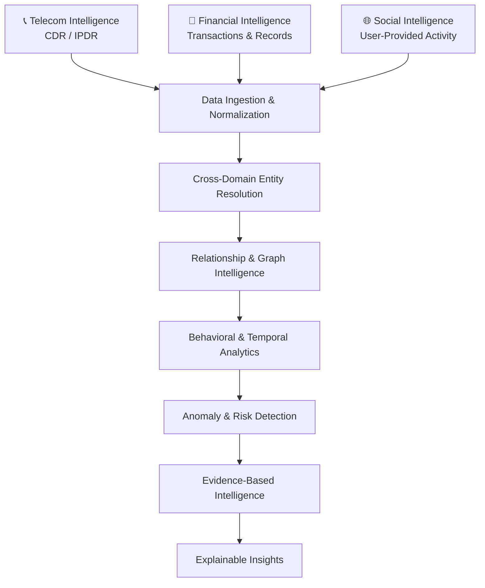

---

# Intelligence Domains

DRISHT1 processes structured and semi-structured information across multiple digital domains.

## 📞 Telecom Intelligence

Telecom records provide insight into communication behavior, network activity, and temporal patterns.

### CDR Signals

- Caller number
- Callee number
- Timestamp
- Call duration
- Cell tower identifier
- IMEI / IMSI

### IPDR Signals

- Source IP
- Destination IP
- Port
- Protocol
- Timestamp
- Data volume
- NAT-mapped mobile number

### Processing Pipeline

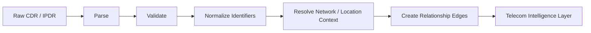

### Analytical Signals

| Signal Category | Examples |
|---|---|
| **Communication** | Burst calling, unusual contact frequency |
| **Temporal** | Odd-hour activity, sudden behavioral changes |
| **Location** | Tower movement patterns and location inconsistencies |
| **Network** | Connections with entities already associated with a case |
| **Data Activity** | Sudden increases in IPDR data volume |

---

## 🏦 Financial Intelligence

Financial records help identify money movement, counterparties, transaction behavior, and unusual patterns.

### Core Data Signals

- Transaction date
- Amount
- Debit / Credit
- Counterparty account or name
- Transaction mode
- UPI / NEFT / RTGS / Cash
- Narration text

### Processing Pipeline


### Analytical Signals

- Transactions near a reporting threshold
- Round-number transfers
- Sudden large inflows or outflows
- High-frequency transfers to newly observed counterparties
- Income and spending inconsistencies

---

## 🌐 Social Intelligence

Social intelligence is designed around **user-provided data exports**, enabling analysis without relying on unrestricted live scraping.

### Available Signals

- Post text
- Timestamp
- Engagement counts
- Mentioned handles
- Geo-tags where available

### Processing Pipeline


### Analytical Signals

| Signal Category | Examples |
|---|---|
| **Behavioral** | Sudden changes in posting activity |
| **Coordinated Activity** | Similar or synchronized posting patterns |
| **Sentiment** | Significant sentiment changes or spikes |
| **Location** | Geo-tags inconsistent with other available signals |
| **Relationships** | Mentions and interactions involving relevant entities |

---

# Cross-Domain Entity Resolution

Entity resolution forms the central intelligence layer of DRISHT1.

A single real-world entity may appear differently across telecom, financial, and social datasets.

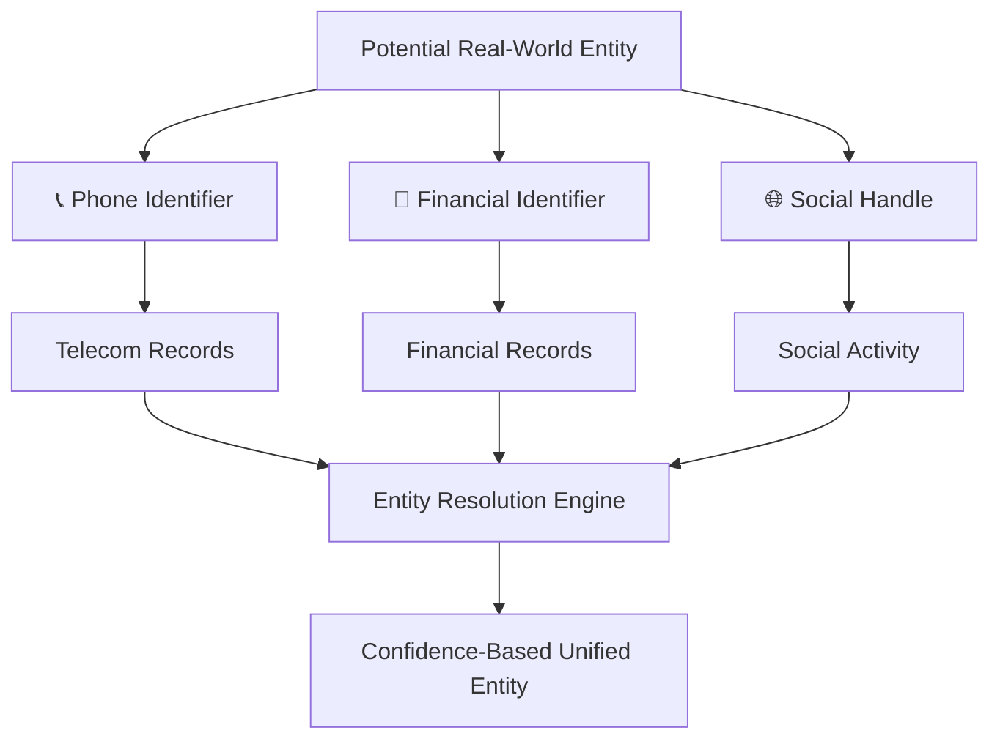

The objective is not to blindly merge records.

Instead, DRISHT1 evaluates available evidence and relationships to determine whether identifiers may represent the same entity.

### Resolution Principles

> **Evidence before correlation. Confidence before consolidation. Every inferred relationship should remain traceable to its supporting signals.**

---

## What Comes Next

The next section continues from this foundation and covers:

- 🔗 Entity Resolution Strategy
- 🕸️ Relationship & Graph Intelligence
- 🚨 Two-Tier Anomaly Detection
- 📦 Evidence-Based Anomaly Objects
- 🤖 Qwen Intelligence Layer
- 🧠 Fine-Tuning Strategy
- 🔎 RAG & Case Intelligence
  # Entity Resolution Strategy

DRISHT1 uses a layered resolution strategy to connect identifiers across different intelligence domains without blindly merging records.

The objective is to build **evidence-backed entity relationships** where every inferred connection can be reviewed and traced.

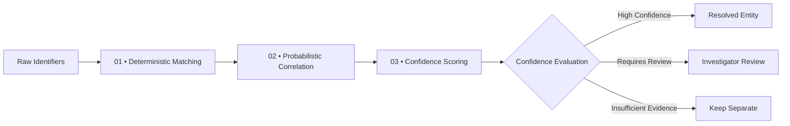

---

## 01 — Deterministic Matching

Direct identifier matches provide the strongest initial evidence for correlation.

**Examples**

- Exact phone numbers
- Exact account identifiers where authorized
- Known identifier relationships

These matches are treated as explicit evidence rather than assumptions.

---

## 02 — Probabilistic Correlation

When exact identifiers are unavailable, DRISHT1 evaluates multiple supporting signals to estimate the likelihood of a relationship.

**Correlation signals**

- Name similarity
- Shared contacts
- Temporal co-occurrence
- Cross-source behavioral similarity

Probabilistic correlation does not automatically mean two records represent the same entity. It contributes evidence to the overall resolution process.

---

## 03 — Confidence Scoring

Every inferred relationship is associated with a confidence value.

```text
Evidence Signals
      ↓
Signal Weighting
      ↓
Confidence Score
      ↓
Relationship Decision
```

Entities are not silently merged without supporting evidence.

> **DRISHT1 preserves the distinction between observed identifiers and inferred relationships, allowing investigators to review how and why a connection was established.**

Once resolved, entities become nodes within the intelligence network, while communications, transactions, and social interactions become relationship edges.

---

# Relationship & Graph Intelligence

DRISHT1 represents connected entities as a relationship network, making it possible to analyze interactions that may not be visible when records are viewed independently.

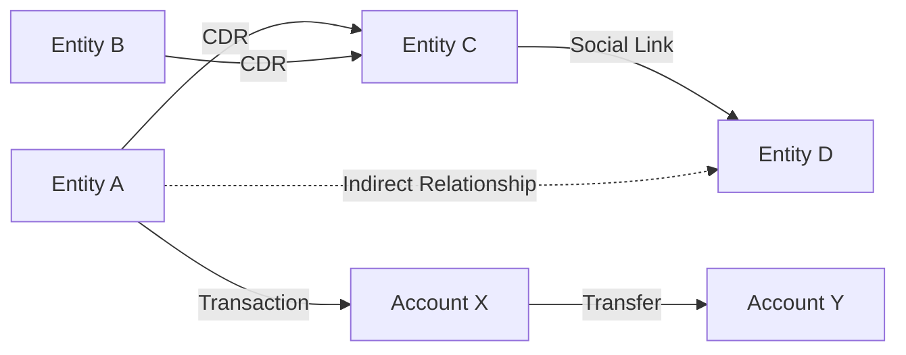

---

## Network Intelligence Capabilities

The relationship layer can analyze:

| Analysis Area | Intelligence Capability |
|---|---|
| **Communication** | Call and interaction relationships |
| **Financial** | Transaction and counterparty connections |
| **Social** | Social interactions and linked entities |
| **Indirect Connections** | Multi-hop relationships between entities |
| **Network Importance** | High-degree and central entities |
| **Communities** | Connected clusters and relationship groups |
| **Path Analysis** | Shortest paths between relevant entities |

---

## Graph Analysis Approach

For the current project scale, DRISHT1 represents relationships through structured edges stored within the platform's relational data layer.

Graph computations are performed in memory for analytical operations such as:

- Community detection
- Centrality analysis
- Shortest-path analysis
- Relationship exploration

This approach keeps the initial architecture focused while still supporting meaningful network intelligence.

---

# Anomaly Detection Engine

DRISHT1 uses a two-tier analytical approach.

The first tier focuses on **fast, deterministic, and explainable detection**, while the second tier identifies more complex behavioral and network deviations.

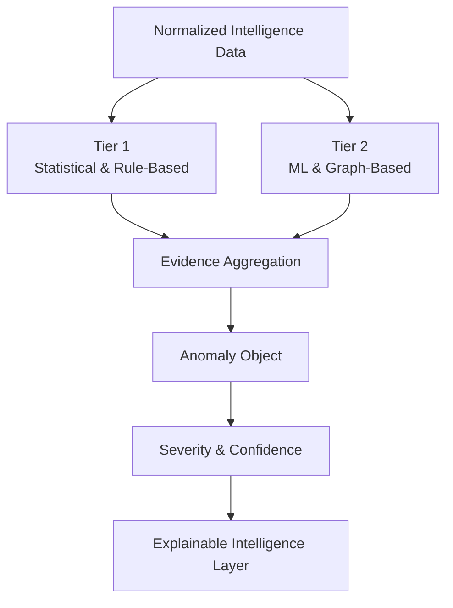

---

## Tier 1 — Statistical & Rule-Based Detection

Tier 1 identifies unusual patterns without requiring a large training dataset.

### Detection Techniques

- Z-score analysis
- IQR outlier detection
- Transaction amount anomalies
- Call-frequency anomalies
- Data-volume anomalies
- Odd-hour activity bursts
- Structuring-like transaction patterns
- Threshold-based red flags

### Why Tier 1 Matters

| Advantage | Value |
|---|---|
| **Fast** | Suitable for rapid analytical screening |
| **Explainable** | Detection triggers can be directly reviewed |
| **Deterministic** | Results can be reproduced |
| **Data Efficient** | Does not require extensive training data |

---

# Tier 2 — ML & Graph-Based Intelligence

Tier 2 focuses on more complex deviations that may not be captured by fixed rules alone.

### Analytical Techniques

- Isolation Forest
- Local Outlier Factor
- DBSCAN
- Community detection
- Centrality analysis
- Shortest-path analysis

### Example Analytical Feature Set

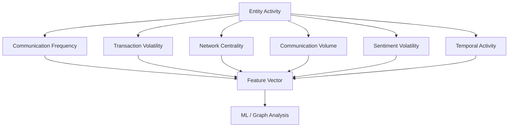

Tier 2 complements statistical detection rather than replacing it.

> **Analytical complexity should not reduce explainability. Every high-level signal should remain connected to supporting evidence wherever possible.**

---

# Evidence-Based Anomaly Model

Every anomaly identified by DRISHT1 is represented as a structured evidence object.

This creates a clear boundary between:

**Detection → Evidence → Explanation**

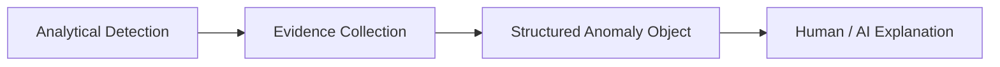

### Core Anomaly Structure

```text
Anomaly
│
├── Entity
├── Type
├── Detection Tier
├── Severity
├── Raw Score
├── Confidence
├── Trigger
├── Evidence References
└── Timestamp
```

The anomaly object acts as the source of truth for downstream explanation and investigation.

> **The language model receives structured analytical evidence. It should not independently invent anomalies from raw data.**

---

# Explainable AI Intelligence Layer

DRISHT1 separates **analytical detection** from **language generation**.

The analytical engine identifies signals.

The evidence layer structures those signals.

The language model transforms validated evidence into readable investigative intelligence.

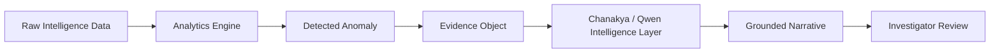

## Core Design Principle

> **Analytics detects. Evidence supports. The language model explains. Humans decide.**

This separation improves:

- Explainability
- Auditability
- Reproducibility
- Reliability
- Human verification

---

# Qwen Intelligence Layer

DRISHT1 uses **Qwen3.5-9B** as its language-model layer for grounded explanation and case intelligence.

The model is designed to work with structured evidence and retrieved case context rather than independently determining what is anomalous.

## Intelligence Capabilities

| Capability | Purpose |
|---|---|
| **Anomaly Explanation** | Convert detected anomalies into readable investigative notes |
| **Investigative Narratives** | Summarize evidence and connected activity |
| **Case Q&A** | Answer investigator questions using retrieved case context |
| **Structured Summaries** | Convert analytical outputs into consistent reports |

---

## Structured Intelligence Workflow

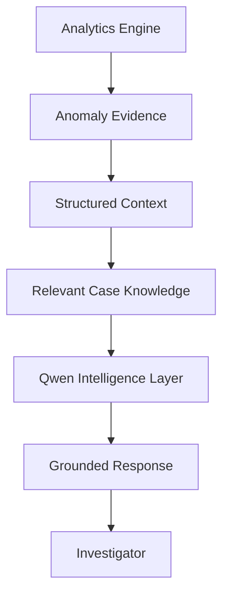

The model's role is explanatory.

> **It explains what the analytical system found instead of deciding what should be considered suspicious.**

---

# Model Adaptation Strategy

DRISHT1 is designed around a targeted adaptation approach rather than full model retraining.

The proposed strategy focuses on adapting the final transformer layers through **LoRA-based fine-tuning** for structured-to-narrative intelligence tasks.

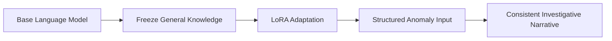

## Why This Approach

- Lower GPU and memory requirements
- Faster experimentation
- Reduced risk of degrading general model capabilities
- Better fit for narrow structured-to-narrative tasks

---

## What the Adapted Model Learns

### 01 — Structured-to-Narrative Generation

Convert structured anomaly evidence into concise, grounded investigative summaries.

```text
Structured Evidence
        ↓
Context & Signals
        ↓
Language Model
        ↓
Investigative Narrative
```

### 02 — Free-Text Case Intelligence

Case-specific question answering is primarily handled through **retrieval-augmented generation (RAG)**.

Instead of embedding all case knowledge permanently into the model, relevant records and summaries are retrieved at query time.

---

# Fine-Tuning Dataset Strategy

Because the task focuses on a specialized intelligence workflow, the training data is designed around generated or authorized analytical evidence.

### Proposed Dataset Pipeline

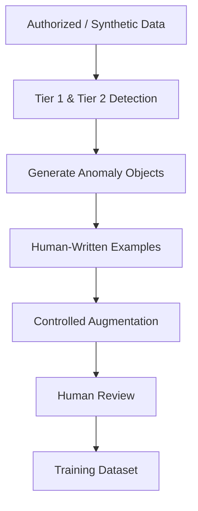


### Dataset Objectives

- Cover different anomaly categories
- Maintain consistent narrative structure
- Preserve evidence references
- Avoid unsupported conclusions
- Support human review and evaluation

---

# Training Configuration

| Component | Proposed Approach |
|---|---|
| **Base Model** | Qwen3.5-9B |
| **Framework** | Hugging Face Transformers + PEFT |
| **Adaptation** | LoRA-based fine-tuning |
| **Target Scope** | Final transformer layers / selected modules |
| **Suggested LoRA Rank** | `r = 8–16` |
| **Training Data** | Generated or authorized anomaly examples |
| **Validation Split** | Approximately 15–20% |
| **Evaluation Focus** | Grounding, factual consistency, and fluency |

The primary evaluation objective is not loss alone.

A useful investigative model must also be evaluated for:

- Factual grounding
- Evidence consistency
- Unsupported claim avoidance
- Clarity
- Narrative quality

---

# RAG & Case Intelligence

DRISHT1 uses retrieval-based intelligence to answer case-specific questions using relevant context.

Structured case records, anomaly summaries, and other authorized investigative context can be indexed for semantic retrieval.

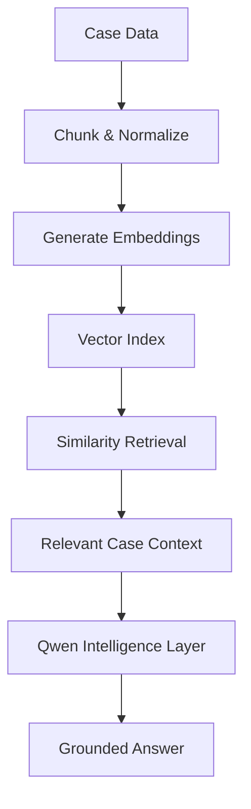

---

## Case Intelligence Queries

Examples of supported investigative questions include:

> **Which entities are connected to Entity A?**

> **Show unusual financial activity associated with Entity B.**

> **Are there communication and transaction relationships between these entities?**

> **Summarize the strongest analytical signals in this case.**

---

## Intelligence Boundary

DRISHT1 follows a strict intelligence boundary:

```text
Data
 ↓
Analytics
 ↓
Evidence
 ↓
Retrieval
 ↓
Language Model
 ↓
Explanation
 ↓
Human Review
```

This architecture is designed to ensure that AI-generated output remains grounded in available evidence and supports investigator decision-making rather than replacing it.

---
# 🏗️ Platform Architecture

DRISHT1 is designed as a layered intelligence platform where data ingestion, analytical processing, relationship intelligence, and AI-assisted explanation work as connected stages.

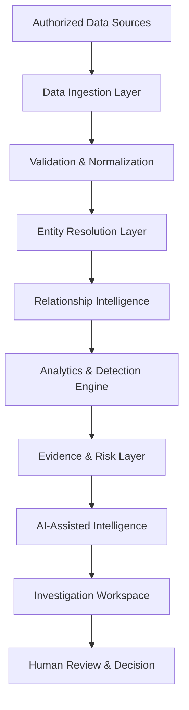

## Platform Layers

| Layer | Responsibility |
|---|---|
| **Data Ingestion** | Receive and process authorized datasets |
| **Normalization** | Standardize identifiers, timestamps, formats, and records |
| **Entity Resolution** | Identify evidence-based cross-domain relationships |
| **Relationship Intelligence** | Build and analyze entity connections |
| **Analytics Engine** | Detect statistical, behavioral, and graph-based anomalies |
| **Evidence Layer** | Preserve triggers, scores, confidence, and supporting records |
| **AI Intelligence** | Generate grounded explanations and investigative summaries |
| **Investigation Workspace** | Present insights, relationships, and analytical findings |
| **Human Review** | Support investigator verification and decision-making |

---

# 🔄 Investigation Workflow

DRISHT1 transforms raw digital records into structured investigative intelligence through a controlled analytical workflow.

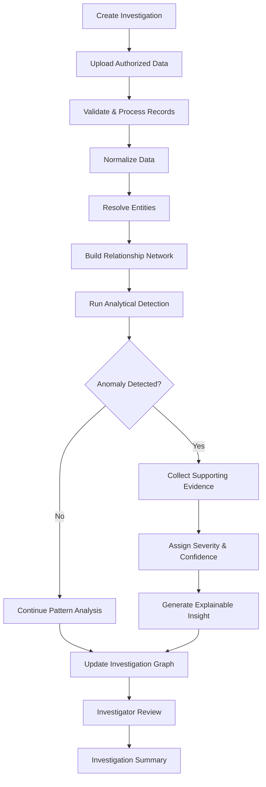

### Investigation Lifecycle

```text
CASE
 │
 ├── Data Collection
 │
 ├── Data Validation
 │
 ├── Normalization
 │
 ├── Entity Resolution
 │
 ├── Relationship Mapping
 │
 ├── Pattern Analysis
 │
 ├── Anomaly Detection
 │
 ├── Evidence Collection
 │
 ├── AI-Assisted Explanation
 │
 └── Human Review
```

> **DRISHT1 is designed to support investigation workflows by organizing and correlating available evidence. Analytical outputs remain available for human review and verification.**

---

# 🧩 Core Platform Capabilities

DRISHT1 combines multiple intelligence functions into a unified investigative environment.

<table>
<tr>

<td width="33%" align="center">

### 📥 Data Intelligence

Multi-source ingestion

Telecom records  
Financial transactions  
Social activity  
Structured datasets

</td>

<td width="33%" align="center">

### 🔗 Entity Intelligence

Cross-domain correlation

Identifier matching  
Confidence scoring  
Relationship evidence  
Entity profiles

</td>

<td width="33%" align="center">

### 🕸️ Network Intelligence

Relationship analysis

Graph exploration  
Communities  
Central entities  
Indirect connections

</td>

</tr>

<tr>

<td width="33%" align="center">

### 🚨 Risk Intelligence

Anomaly detection

Behavioral signals  
Temporal patterns  
Statistical analysis  
Risk indicators

</td>

<td width="33%" align="center">

### 🤖 Explainable AI

Evidence-backed intelligence

Narrative generation  
Case Q&A  
Context retrieval  
Analytical summaries

</td>

<td width="33%" align="center">

### 📊 Investigation Workspace

Unified case analysis

Entity profiles  
Relationship views  
Evidence tracking  
Investigation summaries

</td>

</tr>
</table>

---

# 🎯 Intelligence Workflow

The core intelligence process follows a clear evidence-driven pipeline.


| Stage | Outcome |
|---|---|
| **Ingest** | Authorized records enter the investigation |
| **Normalize** | Data is standardized into consistent formats |
| **Resolve** | Cross-domain identifiers are correlated |
| **Connect** | Relationships become a structured intelligence network |
| **Analyze** | Behavioral, temporal, and network patterns are evaluated |
| **Detect** | Analytical deviations and anomaly signals are identified |
| **Evidence** | Supporting records and triggers are preserved |
| **Explain** | Evidence is transformed into readable intelligence |
| **Review** | Human investigators validate and act on findings |

---

# 📊 Intelligence & Risk Dashboard

The investigation dashboard is designed to provide a high-level view of the active case.

### Dashboard Intelligence

- Active investigations
- Entities under analysis
- Relationship activity
- Detected anomaly signals
- Risk distribution
- Temporal activity
- Cross-domain connections
- Evidence-backed alerts

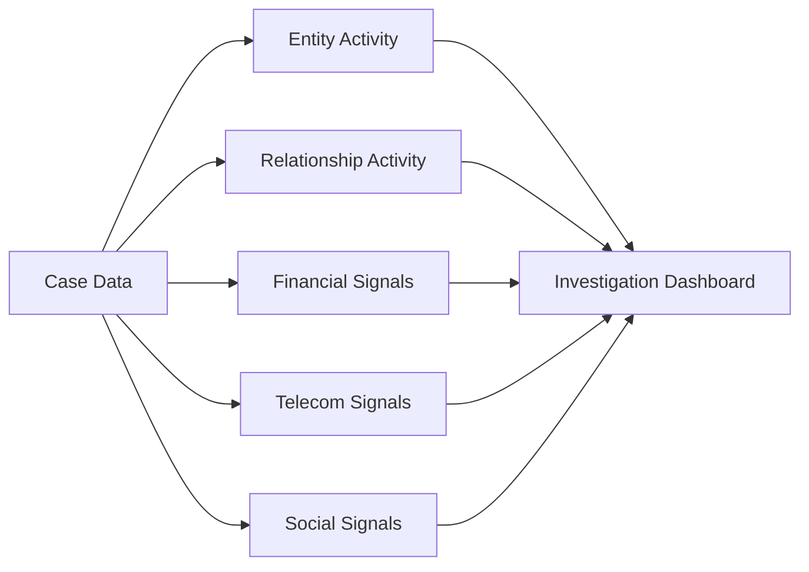

---

# 🔐 Security & Investigation Controls

Because DRISHT1 processes sensitive investigative data, security and controlled access are important parts of the platform design.

## Security Principles

| Control Area | Purpose |
|---|---|
| **Authentication** | Verify authorized platform access |
| **Role-Based Access** | Restrict capabilities according to user responsibility |
| **Case Isolation** | Keep investigation data logically separated |
| **Data Validation** | Reduce malformed or inconsistent input |
| **Audit Logging** | Preserve activity history where implemented |
| **Evidence Traceability** | Maintain links between insights and source evidence |
| **Controlled AI Context** | Limit AI responses to supplied analytical and retrieved context |

### Security Workflow

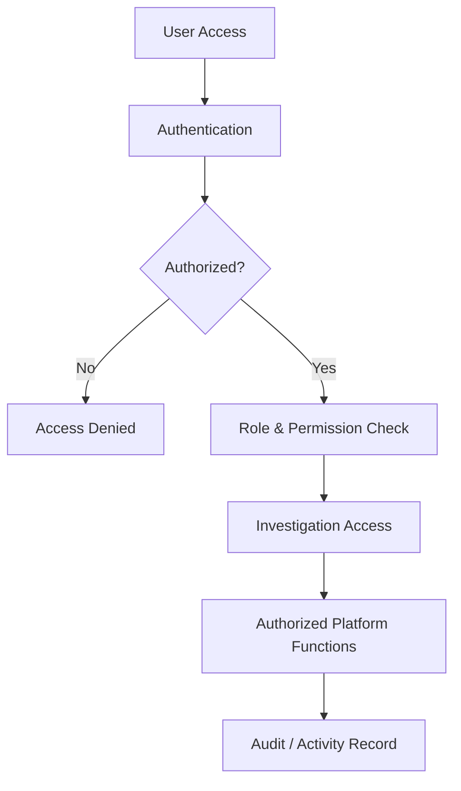

---

# ☁️ Operational Architecture

DRISHT1 is structured as an intelligence platform with clear separation between users, application services, analytical processing, AI intelligence, and data management.

```mermaid
flowchart TD

    A[Investigators & Authorized Users]

    A --> B[Secure Investigation Workspace]

    B --> C[Identity & Access Control]

    C --> D[Core Intelligence Services]

    D --> E[Data Processing]

    D --> F[Entity & Relationship Analysis]

    D --> G[Anomaly & Risk Analytics]

    D --> H[AI Intelligence Layer]

    E --> I[Secure Case Data]

    F --> I
    G --> I

    H --> J[Grounded Intelligence Output]

    J --> B
```

> The operational view intentionally focuses on platform responsibilities rather than exposing implementation-specific infrastructure details.

---

# 🖼️ Application Screenshots

<p align="center">
  Explore the key interfaces and capabilities of the DRISHT1 platform.
</p>

<br>

## 📊 Intelligence Dashboard

<p align="center">
  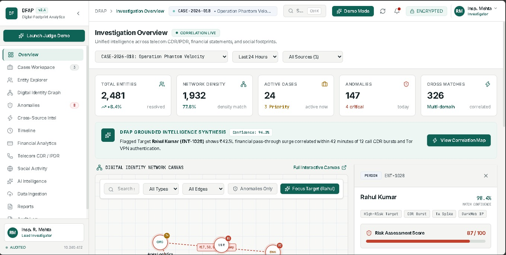
</p>

<p align="center">
  <i>Centralized intelligence overview and case analytics.</i>
</p>

---

## 🔍 Investigation & Entity Analysis

<p align="center">
  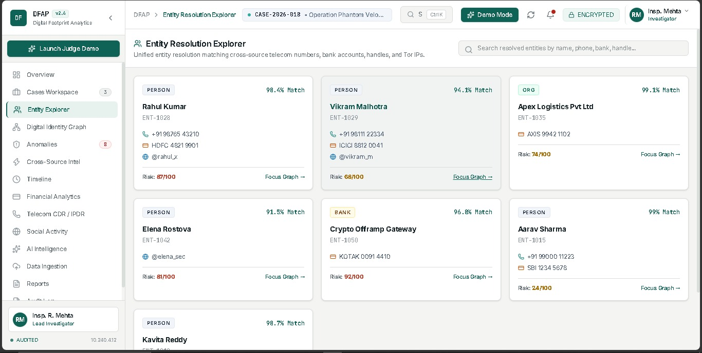
</p>

<p align="center">
  <i>Analyze entities and investigate relationships across multiple data sources.</i>
</p>

---

## 📞 Telecom & Activity Analysis

<p align="center">
  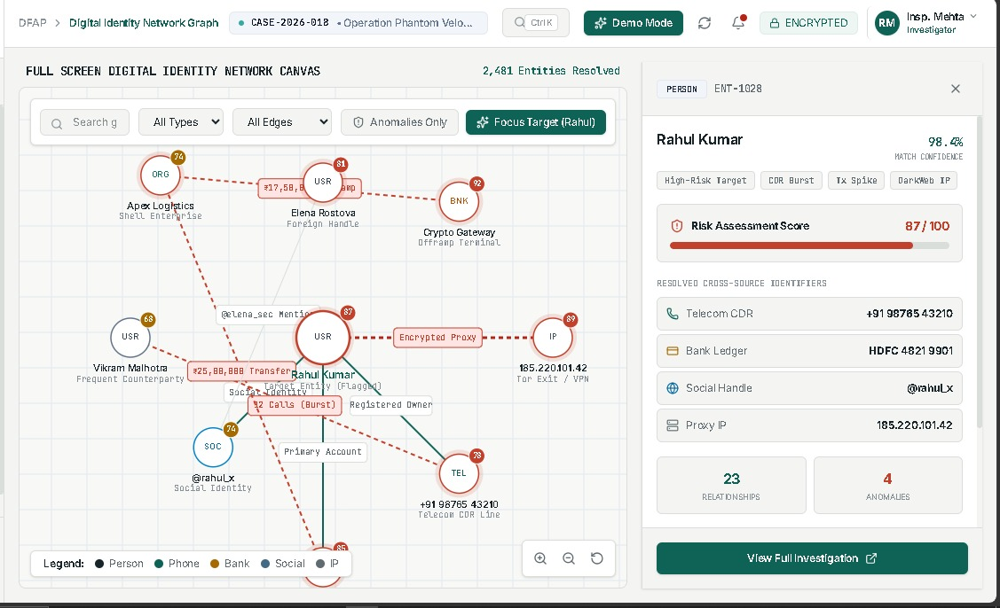
</p>

<p align="center">
  <i>Explore communication patterns, activity timelines, and behavioral signals.</i>
</p>

---

## 🤖 AI Intelligence Assistant

<p align="center">
  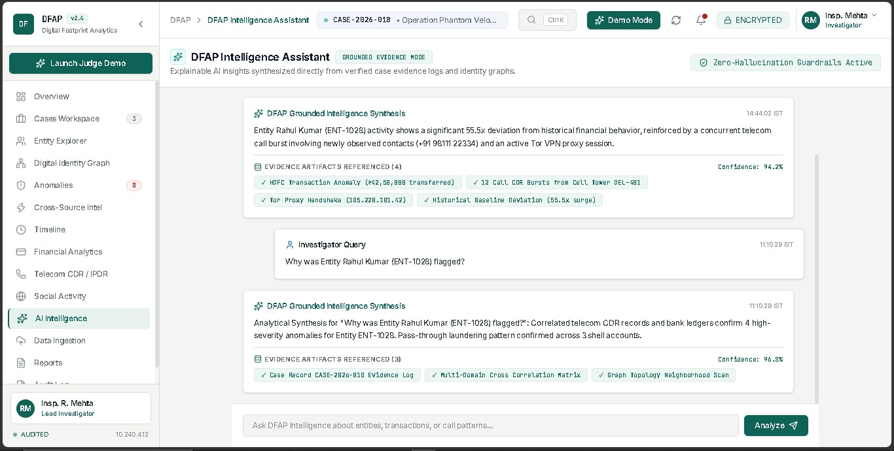
</p>

<p align="center">
  <i>Ask investigative questions and receive grounded, explainable insights.</i>
</p>

---

## 🕸️ Graph & Relationship Intelligence

<p align="center">
  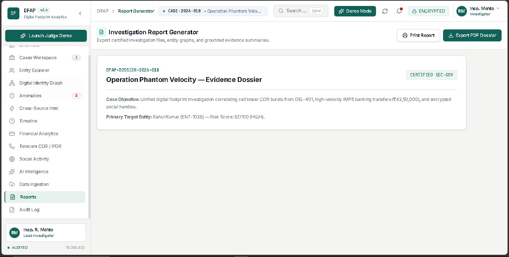
</p>

<p align="center">
  <i>Visualize cross-domain relationships and discover hidden connections.</i>
</p>

# 📌 Platform Summary

DRISHT1 brings together multiple stages of digital investigation into a single intelligence workflow.

```mermaid
flowchart LR

    A[Digital Data]
    --> B[Unified Intelligence]

    B --> C[Entity Resolution]

    C --> D[Relationship Analysis]

    D --> E[Anomaly Detection]

    E --> F[Evidence]

    F --> G[Explainable Intelligence]

    G --> H[Human Decision]
```

### Core Principle

> **DRISHT1 does not treat AI-generated text as the source of investigative truth. Analytical findings, evidence references, and human review remain central to the intelligence workflow.**

---
# ⚡ Performance Goals

DRISHT1 is designed with a focus on responsive investigation workflows, scalable analytical processing, and efficient handling of structured intelligence data.

| Area | Target |
|---|---|
| **Dashboard Experience** | Responsive interactive interface |
| **Standard API Operations** | Optimized for low-latency responses |
| **Data Processing** | Asynchronous processing for larger datasets |
| **Investigation Queries** | Efficient filtered and indexed retrieval |
| **Analytics** | Scalable statistical and graph analysis |
| **AI Responses** | Grounded in supplied evidence and retrieved context |
| **Architecture** | Designed for modular expansion |

> Performance characteristics may vary depending on dataset size, analytical complexity, infrastructure, and model deployment configuration.

---

# 🧩 Capability Matrix

| Intelligence Area | Capability |
|---|:---:|
| Multi-Source Data Ingestion | ✅ |
| Telecom CDR Analysis | ✅ |
| IPDR Analysis | ✅ |
| Financial Transaction Analysis | ✅ |
| User-Provided Social Data Analysis | ✅ |
| Data Normalization | ✅ |
| Cross-Domain Entity Resolution | ✅ |
| Confidence-Based Relationships | ✅ |
| Relationship Mapping | ✅ |
| Graph Analysis | ✅ |
| Community Detection | ✅ |
| Centrality Analysis | ✅ |
| Temporal Pattern Analysis | ✅ |
| Statistical Anomaly Detection | ✅ |
| ML-Based Anomaly Analysis | ✅ |
| Evidence-Based Anomaly Objects | ✅ |
| Risk & Severity Assessment | ✅ |
| Explainable AI Narratives | ✅ |
| Case Intelligence Q&A | ✅ |
| Retrieval-Augmented Generation | ✅ |
| Investigation Dashboard | ✅ |
| Role-Based Access | ⚙️ |
| Audit & Activity Tracking | ⚙️ |

**Legend:**  
✅ Available / Included in platform scope  
⚙️ Architecture or implementation component under active development

---

# 🗺️ Development Roadmap

DRISHT1 is structured to evolve in stages, allowing the intelligence pipeline to mature without coupling every capability to the first release.

```mermaid
timeline
    title DRISHT1 Development Roadmap

    section Foundation
        Data ingestion : Structured data processing
        Normalization : Unified record formats
        Entity layer : Cross-domain resolution

    section Intelligence
        Graph analysis : Relationship exploration
        Anomaly detection : Statistical & ML signals
        Evidence model : Traceable anomaly objects

    section AI
        Explainable narratives : Grounded intelligence
        RAG : Case-aware Q&A
        Model adaptation : Structured-to-narrative learning

    section Expansion
        Advanced analytics : Additional intelligence signals
        Investigation workflows : Enhanced case management
        Platform scaling : Modular operational growth
```

---

# 🎯 Design Principles

DRISHT1 is built around a set of principles intended to keep the intelligence workflow understandable, evidence-oriented, and reviewable.

<table>
<tr>
<td width="50%" valign="top">

### 🔎 Evidence First

Analytical outputs should remain connected to the underlying records, triggers, and supporting signals.

</td>

<td width="50%" valign="top">

### 🧠 Explainable Intelligence

AI-generated narratives are designed to explain available analytical findings rather than invent unsupported conclusions.

</td>
</tr>

<tr>
<td width="50%" valign="top">

### 👤 Human Review

The platform is intended to support investigators and analysts, with important conclusions remaining subject to human verification.

</td>

<td width="50%" valign="top">

### 🔐 Controlled Access

Sensitive intelligence workflows require authorization, role-aware access, and traceable activity where implemented.

</td>
</tr>

<tr>
<td width="50%" valign="top">

### 🧩 Modular Architecture

Individual intelligence capabilities can evolve independently while remaining connected through a unified workflow.

</td>

<td width="50%" valign="top">

### 📊 Cross-Domain Context

The platform focuses on correlations between domains, helping reveal patterns that isolated datasets may not expose.

</td>
</tr>
</table>

---

# ❓ Frequently Asked Questions

### What is DRISHT1?

DRISHT1 is a digital intelligence and analytics platform designed to process and correlate authorized telecom, financial, and social-media datasets into a unified investigative view.

---

### What makes DRISHT1 different from a standard analytics dashboard?

The platform focuses on the connection between multiple intelligence domains through:

- Entity resolution
- Relationship analysis
- Graph intelligence
- Behavioral analytics
- Evidence-based anomaly detection
- Explainable AI

The objective is to move from isolated records toward connected, evidence-backed intelligence.

---

### Does the AI independently decide that something is suspicious?

No.

DRISHT1 separates anomaly detection from language generation.

```text
Analytics identifies signals
            ↓
Evidence supports the finding
            ↓
AI explains the available evidence
            ↓
Human reviews the result
```

The language model is not intended to independently create anomalies from raw records.

---

### How are entities connected across different datasets?

The platform uses a layered approach involving:

1. Deterministic identifier matching
2. Probabilistic correlation
3. Confidence scoring
4. Evidence-backed relationship representation

Connections can then be reviewed rather than silently assumed.

---

### Does DRISHT1 require a dedicated graph database?

Not necessarily for the initial implementation.

Relationship edges can be represented in the primary data layer and analyzed in memory using graph-processing techniques.

The architecture can later evolve if larger-scale graph workloads require dedicated infrastructure.

---

### What type of social-media data does DRISHT1 analyze?

The platform design focuses on **authorized or user-provided data exports** rather than unrestricted live scraping.

Possible information includes:

- Post content
- Timestamps
- Engagement information
- Mentioned entities
- Available geographic metadata

---

### What is the role of the language model?

The language model supports:

- Explaining analytical findings
- Generating investigative narratives
- Answering case-related questions with retrieved context
- Creating readable summaries from structured evidence

---

### Is DRISHT1 designed to replace investigators?

No.

DRISHT1 is intended as an **investigator-support and analytical intelligence platform**.

Human review remains an important part of interpreting evidence and making decisions.

---

# 📊 Project Status

<div align="center">

| Component | Status |
|---|:---:|
| Platform Architecture | 🟢 Designed |
| Data Intelligence Layer | 🟢 In Progress |
| Entity Resolution | 🟢 In Progress |
| Relationship Intelligence | 🟢 In Progress |
| Anomaly Detection | 🟢 In Progress |
| Evidence Model | 🟢 Designed |
| AI Intelligence Layer | 🟡 Experimental |
| RAG & Case Q&A | 🟡 Experimental |
| Model Adaptation | 🔵 Research Phase |

</div>

> DRISHT1 is an evolving project. Features and implementation details may change as the analytical architecture develops.

---

# 🤝 Contribution

DRISHT1 is a project focused on building a structured and explainable digital intelligence workflow.

Contributions, architectural suggestions, research discussions, and improvements are welcome where appropriate.

Potential areas of contribution include:

- Data normalization
- Entity resolution
- Graph algorithms
- Statistical analytics
- Machine learning
- Explainable AI
- Retrieval systems
- Investigation workflows
- User experience
- Documentation

---

# 📞 Contact & Project Links

<div align="center">

### 🛡️ DRISHT1

**Digital Risk & Intelligence System for Threat Investigation**

<br>

🌐 **Project Website**  
<a href="#">Coming Soon</a>

<br>

🐙 **GitHub Organization**  
<a href="[https://github.com/](https://github.com/DRISHT1)">View Project Organization</a>

<br>

💼 **LinkedIn**  
<a href="#">Project Updates</a>

<br>

📧 **Contact**  
<a href="mailto:contact@example.com">contact@example.com</a>

</div>

---

# 🧠 Acknowledgements

DRISHT1 brings together concepts from multiple areas of computer science and data intelligence.

The project architecture incorporates ideas from:

- Graph Theory & Network Analysis
- Statistical Anomaly Detection
- Machine Learning
- Entity Resolution
- Natural Language Processing
- Retrieval-Augmented Generation
- Explainable AI
- Digital Forensics
- Data Engineering
- Intelligence Analysis

---

# ⚖️ Responsible Use

DRISHT1 is designed for analysis of **authorized, lawfully obtained, or user-provided data**.

The platform should be used with appropriate consideration for:

- Applicable laws and regulations
- Data protection requirements
- Authorization and access controls
- Privacy considerations
- Human oversight
- Responsible interpretation of analytical results

Analytical signals and AI-generated narratives should be treated as **decision-support information**, not as automatic proof or final conclusions.

---

# 📜 License

Copyright © 2026 **DRISHT1**.

All rights reserved.

This project and its associated documentation, architecture, and implementation may be subject to the licensing terms defined by the project owners.

Unauthorized copying, redistribution, or commercial use may be restricted according to the applicable license.

---

<div align="center">


# 🛡️ DRISHT1

### Digital Risk & Intelligence System for Threat Investigation

**Connecting digital signals. Revealing hidden relationships. Supporting evidence-driven intelligence.**

<br>

> **From isolated records to connected intelligence.**

<br>

⭐ **If you find this project interesting, consider supporting it on GitHub.**

<br>

**Built with a focus on intelligence, explainability, and responsible AI.**

</div>
